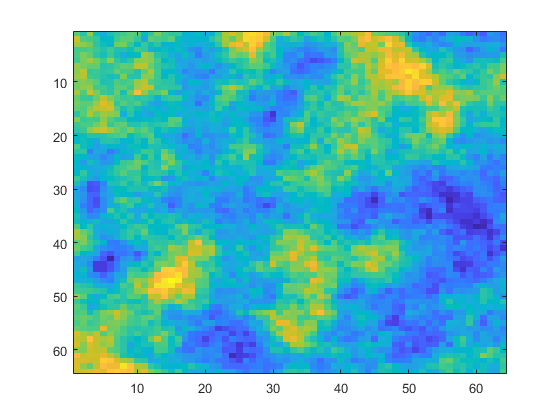

# Spatial-Correlated-Shadow-Fading
Matlab implementation of spatial correlated shadow fading

``` matlab
function sfm = genSfm2D(nPixelsX,nPixelsY,resol,decorrDist,meanSfv,stdDevSfv)
%% This function returns a one-dimensinal shadow fading map.
% @param nPixelsX: number of pixels in the horizental direction of the map
% @param nPixelsY: number of pixels in the vertical direction of the map
% @param resol: resolution of the map in meteres or meters per pixel
% @param decorrDist: the distance at which the PSD of the intended random
% process is reduced by half
% @param meanSfv: mean value of shadow fading corresponding the path loss
% at the location in dB
% @param stdDevSfv: standard derivation of shadow fading
% @return a 2-D space correlated shadowing fading map, nPixelsX-by-nPixelsY double

% @ References
% [1]Fraile,et al. "Mobile radio bi-dimensional large-scale fading modelling with site-to-site cross-correlation."
% [2]Dittrich, et al. "An efficient method for avoiding shadow fading maps in system level simulations." 
% [3]Vienna 5G System Level Simulator (https://www.nt.tuwien.ac.at/research/mobile-communications/vccs/vienna-5g-simulators/)

```



